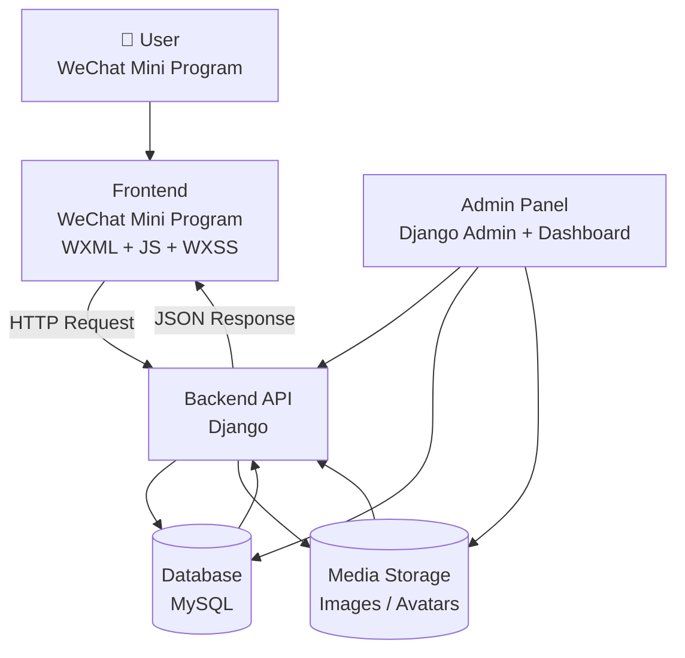
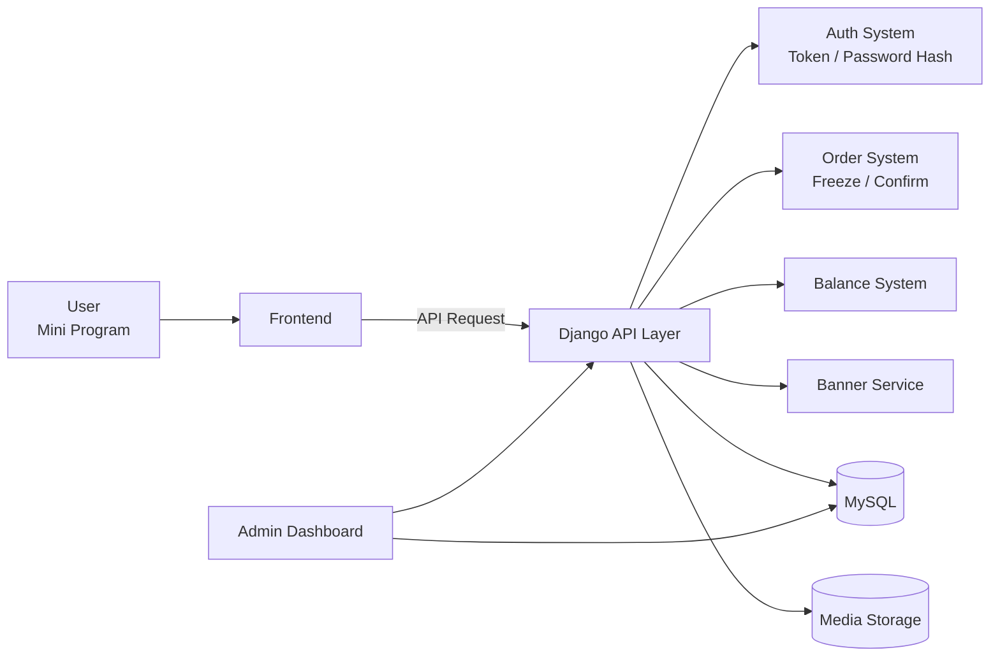

# E-commerce Mini Program System

## Overview
This project is a production-ready e-commerce system developed for a gaming club.  
It allows users to browse products, place orders, and interact with the platform.

## Features
- Product browsing
- Order placement system
- Admin dashboard for product management
- Sales analytics and visualization

## Tech Stack
- Backend: Django
- Database: MySQL
- Frontend: WeChat Mini Program

## Key Highlights
- Built a system with real users and live transactions
- Designed backend APIs and database schema
- Developed admin dashboard for sales tracking and analysis

## Note
This repository contains a simplified version of the project for demonstration purposes.  
Some business logic and sensitive configurations have been removed.

## System Architecture

## Architecture Overview

This project is a full-stack WeChat Mini Program system, consisting of:

### Frontend
- Built with WeChat Mini Program (WXML / JS / WXSS)
- Handles user interaction, UI rendering, and API requests

### Backend
- Built with Django
- Provides REST-style APIs:
  - User authentication (login/register/token)
  - Order system (create / confirm / refund)
  - Payment logic (balance / freeze)
  - product data

### Database
- MySQL
- Stores:
  - Users
  - Orders
  - Products
  - Balance logs

###  Media Storage
- Stores:
  - User avatars
  - Product images

### Admin Panel
- Django Admin + custom dashboard
- Used for:
  - Managing users / products
  - Viewing statistics (charts / revenue / orders)

